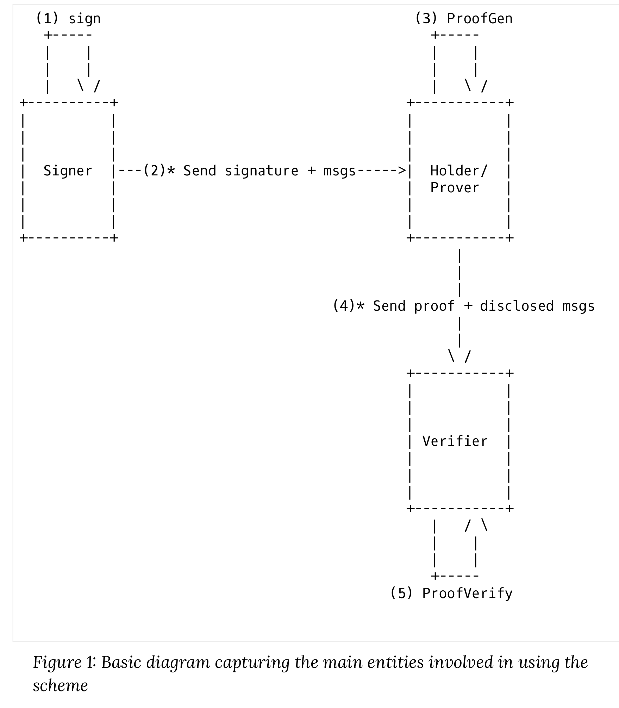

# SHARCS Readme

## Prerequisies / Tested with

- [Node.js](https://nodejs.org/en), ~v18.18.2
- [yarn](https://yarnpkg.com/)

## Run

1. Install `yarn i`
2. Start the CSS `npx @solid/community-server -c @css:config/file-no-setup.json -f ./.data`
3. Run the demo `.\node_modules\.bin\ts-node index.ts`
3. Run the jsonld-proof-demo `.\node_modules\.bin\ts-node jsonld-signature-bbs.ts`

## Files to note

This repo contains two runnable examples of notice

1. `index.ts` :: the entry point for the main demo. Shows how the _jsonld-signatures_ library can be used to store/sign/derive/validate credentials on a Solid Pod. Run it with `.\node_modules\.bin\ts-node index.ts` (or `ts-node index.ts` if `ts-node` is in PATH)
  - `login.ts` :: requests login credentials from the CSS. Needed to to HTTP fetch from the Pod. Will build an authenticated fetch (`authFetch`) from the credentials. See the [CSS docs](https://communitysolidserver.github.io/CommunitySolidServer/6.x/usage/client-credentials/) for more info.
  - `signing.ts` :: uses the _jsonld-signatures_ to sign/derive/validate credentials.

2. `jsonld-signature-bbs.ts` :: commented sample code from the https://github.com/mattrglobal/jsonld-signatures-bbs/ repo. Shows the capabilities of the _jsonld-signatures_ library, useful for testing the signing process. Run it with `.\node_modules\.bin\ts-node jsonld-signatures-bbs.ts` (or `ts-node jsonld-signatures-bbs.ts` if `ts-node` is in PATH)

This repo only demonstrates how to store/sign/verify/derive credentials on a single Solid Pod. An extended workflow between multiple Pods via LDN can be found in the [tri-pod-demo](https://gitlab.ilabt.imec.be/KNoWS/projects/sharcs/tri-pod-demo/-/tree/master) repository.

## Stakeholders/Actors in the system

[^1] 

- Signer ("Government") :: produces original signed message/document and sends it to Holder/prover
- Holder/prover ("Alice") :: holds the credentials 
    - this is 'us'; this is where the Pod and the agent operate on
    - can choose what to disclose ('selective disclosure')
- Verifier/receiver ("Bob") :: wants to know something; receives the proof and disclosed messages

## Resouces

- https://github.com/mattrglobal/jsonld-signatures-bbs
    - use for creating the VCs -> JSON-LD?
- https://github.com/SolidLabResearch/Solid-Agent/tree/main/documentation/ucp 
  - used for setup (and remote code execution? to be evaluated)
  - update: not used anymore; but some code remains remain! (TODO: delete/clean them)

[^1]: https://identity.foundation/bbs-signature/draft-irtf-cfrg-bbs-signatures.html#figure-1
